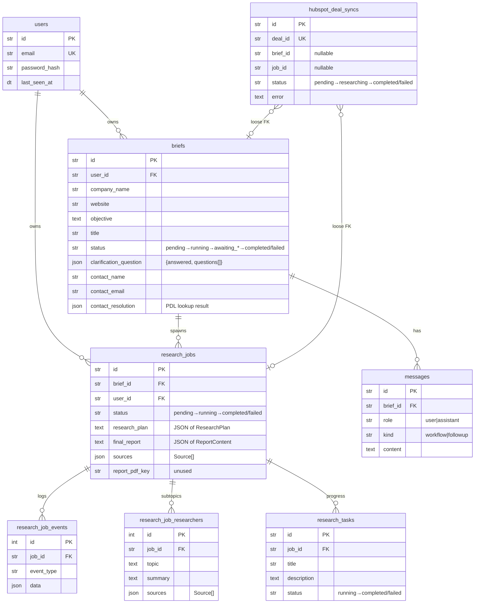
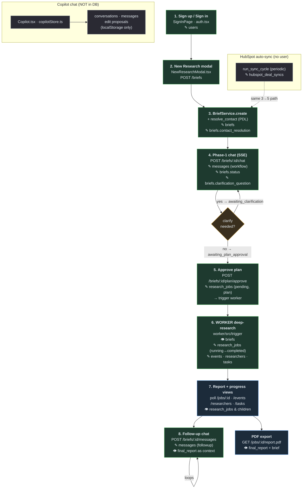

# Data Flow & Schema Map

How each component reads/writes the database, traced along the user flow.
Two DB clients hit the **same Postgres**:

- **Backend** (FastAPI + SQLAlchemy, `backend/app/persistence`) — auth, briefs, phase-1 chat, job creation, follow-up chat, reads for the UI.
- **Worker** (Trigger.dev + Drizzle, `worker/src/db`) — phase-2 research execution; writes job results/progress, reads the brief.

> ⚠️ **Copilot** (chat threads / edit proposals) is **not persisted** — it lives in `localStorage` (`frontend/src/lib/copilotStore.ts`). No table yet.

---

## 1. Entity map (who writes ✎ / reads 👁 each field)

---

## 2. User flow → what touches the DB

Legend: **✎ write**, **👁 read**. Steps run top to bottom; DB effects are shown
_inside_ each node so the arrows stay clean.

---

## 3. Per-surface field usage

### Auth — `users`
- **Write**: `auth_service` on signup (`email`, `password_hash`), `touch_last_seen` on each request.
- **Read**: `get_current_user` (JWT→id), `/me/activity` → `counts()` + `recent_briefs()`.

### Brief creation — `briefs`
- **Manual**: `NewResearchModal` → `POST /briefs` → `BriefService.create`.
- Core fields set at create: `company_name`, `website`, `objective`, `title`, `contact_name/email`.
- `contact_resolution` filled **async right after create** via `resolve_contact` (People Data Labs). Shape = `ContactResolution` (`status: resolved|unresolved|skipped`, `likelihood`, `linkedin_url`, …).
- **HubSpot intake** builds the same brief from deal→company→contact properties.

### Phase-1 chat — `messages` + `briefs`
- `POST /briefs/:id/chat` (SSE). `WorkflowService.run_phase1`:
  - ✎ `messages` (`role=user`, `kind=workflow`) for each turn.
  - ✎ `briefs.status`: `running` → `awaiting_clarification` | `awaiting_plan_approval` | `failed`.
  - ✎ `briefs.clarification_question` = `{answered, questions[]}`; `mark_clarification_answered` folds answers back in.
  - LangGraph state (plan, transient messages) lives in the **checkpointer**, not these tables.
- **Note**: assistant/workflow replies stream over SSE; only the *user* turn is persisted as a `workflow` message.

### Plan approval → job — `research_jobs`
- `POST /briefs/:id/plan/approve` → `job_store.create_job`: reads plan from graph checkpoint, ✎ `research_jobs` (`status=pending`, `research_plan`=JSON), triggers the worker.

### Worker execution (phase 2) — writes progress
`worker/src/db/jobs.ts` on the **same tables**:
| Fn | Writes |
|---|---|
| `getBrief` | 👁 `briefs` (company, website, objective, contact*) |
| `updateJobStatus` | ✎ `research_jobs.status` (`running`/`failed`) |
| `updateJobResult` | ✎ `research_jobs` → `completed`, `final_report`, `sources` |
| `appendJobEvent` | ✎ `research_job_events` (event_type, data) |
| `appendResearcherResult` | ✎ `research_job_researchers` (topic, summary, sources) |
| `createTask`/`completeTask`/`failTask` | ✎ `research_tasks` (title, description, status) |

### Report & progress views — read-only polling
- `Researches.tsx` → `GET /briefs` (list of `briefs`).
- Detail/progress → `GET /briefs/:id/job` then poll `/jobs/:id`, `/jobs/:id/events`, `/researchers`, `/tasks`.
- `final_report` = JSON-encoded `ReportContent` (`summary`, `sections[]{heading,content,source_ids}`, `sources[]`).
- PDF: `GET /jobs/:id/report.pdf` reads `job.final_report` + `brief.company_name/objective`. `report_pdf_key` column exists but is **unused** (rendered on the fly).

### Follow-up chat — `messages`
- `POST /briefs/:id/messages` → `report_chat.stream_followup`: ✎ `messages` (`kind=followup`), grounds the answer on `final_report`. Listed via `GET /briefs/:id/messages?kind=followup`.

### HubSpot sync — `hubspot_deal_syncs` (service-owned, no user scope)
- Dedup by unique `deal_id`. `status` walks `pending → researching → completed|failed`.
- `brief_id`/`job_id` link back once intake dispatches. Write-back pass posts the dashboard link as a deal Note on completion.

### Copilot — **no table (gap)**
- `copilotStore.ts` persists `CopilotConversation`, `CopilotMessage`, `EditProposal` to `localStorage`; replies are a stub. `selected_brief_ids` scopes which researches it would ground on / edit.
- To productionize: needs tables for conversations, messages, and proposals (proposals target a `brief`'s report section → implies report versioning).

---

## 4. Notes for planning features
- **Report is a single blob** (`research_jobs.final_report` JSON). Editing sections (Copilot proposals) currently has no versioning/section-addressable storage — the biggest schema gap.
- **One brief : many jobs** possible (list endpoint exists), but the UI treats the latest job as canonical (`get_job_by_brief` = most recent).
- **`report_pdf_key`** is a dead column (no object-store caching yet).
- **Backend and worker duplicate the schema** (`models.py` vs `schema.ts`) — any new column must be added in both + a new Alembic migration.
- **LangGraph checkpointer** holds phase-1 transient state (plan, messages) separately from these tables — the `research_plan` is only durably persisted when a job is created.
