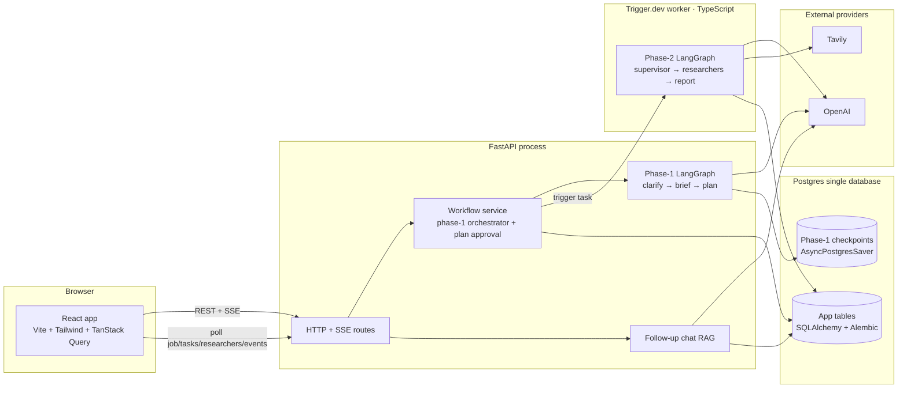
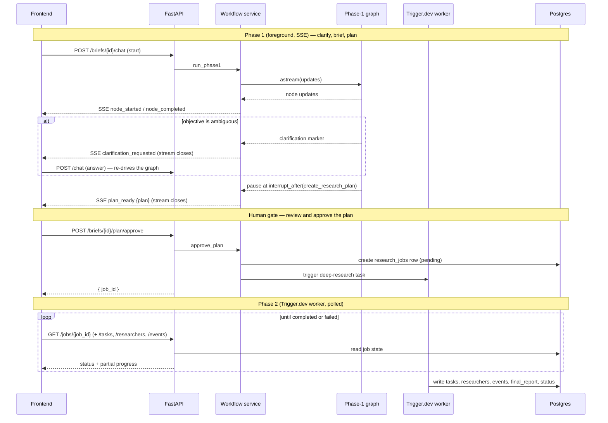
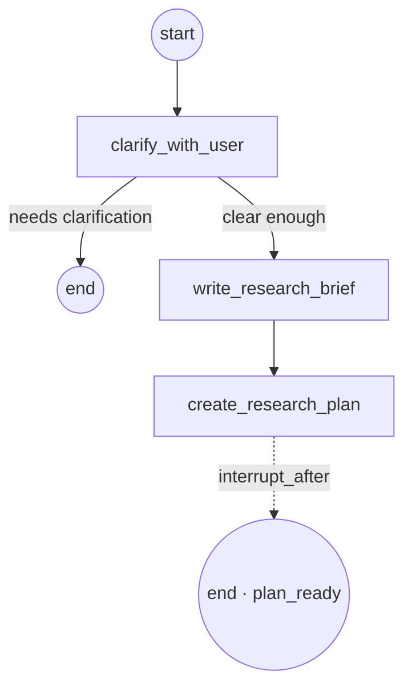
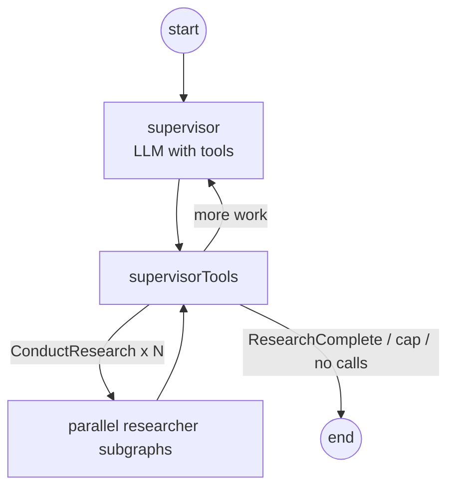
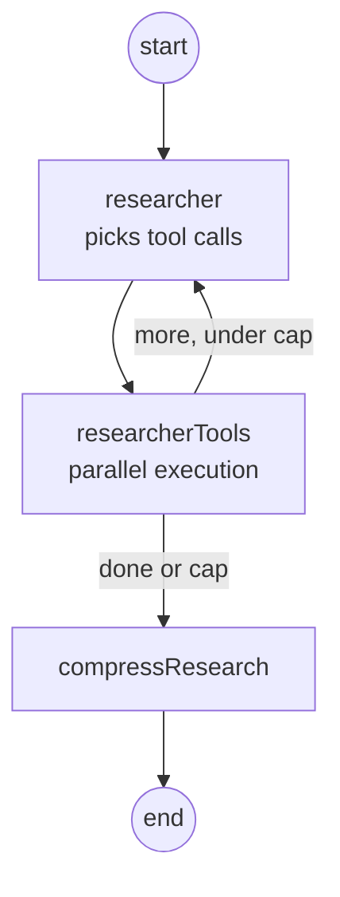

# Architecture

Research Copilot turns a company name, website, and research objective into a structured sales briefing, then lets the user chat with that briefing. This document explains how the system is put together: the moving parts, how they talk to each other, how the two LangGraph workflows run, and how the design holds up when things go wrong.

## 1. The big picture

Three design choices shape everything else:

1. **The research run is split across two runtimes.** A short interactive phase runs inside the FastAPI backend and streams over SSE. The long research phase runs in a separate **Trigger.dev worker** (TypeScript) and is polled. The seam between them is a human plan-approval step. More in section 4.
2. **Phase 1 and phase 2 are two distinct LangGraph implementations.** Phase 1 is Python, in-process, and checkpointed. Phase 2 is TypeScript, runs on Trigger.dev, and writes its progress straight to Postgres. They share nothing but the database. More in section 6 and 7.
3. **One database, clear ownership.** The phase-1 checkpointer owns in-flight graph state; the application tables own the durable products (briefs, jobs, reports, chat). More in section 5.

## 2. The stack

| Layer | Choices |
|---|---|
| Frontend | React 18, TypeScript, Vite, Tailwind, TanStack Query, React Router, react-markdown |
| Backend | Python 3.12, FastAPI, SQLAlchemy 2.0 (async, asyncpg), Pydantic settings, structlog |
| Phase-1 workflow | LangGraph (Python), checkpointed with `AsyncPostgresSaver` |
| Phase-2 worker | LangGraph (TypeScript) on Trigger.dev v4, Drizzle ORM over `pg` |
| AI providers | OpenAI for reasoning and writing, Tavily for search — called directly on both sides |
| Transport | REST for reads and actions, SSE for live progress and token streaming, polling for phase-2 progress |
| Schema | Alembic migrations own all app-table DDL; the runtime never runs DDL |

## 3. Component breakdown

**Frontend (`frontend/src`).** A single-page React app. Routes cover the landing page, sign in and sign up, the dashboard (brief history plus create form), and the brief detail page. The detail page is where most of the work shows: a chat panel that narrates progress, a clarification card, a plan card with an approve action, an artifact workspace (research angles, sources, the rendered report), and source citations. Server state is held in TanStack Query. The two live streams (phase-1 progress and follow-up chat) are read over SSE through dedicated hooks (`useWorkflowChat`, `useReportChat`); `useSessionStatus` polls the job, and the detail page polls the per-job `tasks`, `researchers`, and `events` while a run is in flight. `lib/runStatus.ts` derives one lifecycle status object from that polled state so the chat bubble and the artifact panel always agree, live or after a reload.

**Backend API (`backend/app/api`).** Thin FastAPI routers grouped by concern: auth, users, briefs, the phase-1 workflow stream, job reads, and follow-up chat. Routers do request validation, ownership checks, and shaping; they hand the real work to the service layer. Every route that touches a brief or job confirms the caller owns it, and an ownership mismatch returns 404 rather than 403 so we never leak that a record exists.

**Workflow service (`backend/app/services/workflow_service.py`).** The phase-1 orchestrator. It builds the phase-1 graph with the checkpointer, drives the run inline as an event stream, persists the user's turns, and stores the plan when the graph pauses. On plan approval it reads the approved plan off the checkpoint, creates the `research_jobs` row, and dispatches the Trigger.dev worker.

**Phase-1 LangGraph (`backend/app/workflow`).** The interactive front of the run: `clarify_with_user → write_research_brief → create_research_plan`. Covered in section 6.

**Phase-2 worker (`worker/`).** A standalone TypeScript Trigger.dev project that owns the research run: supervisor, parallel researchers, and the two-pass report writer. Covered in section 7.

**Follow-up chat (`backend/app/services/report_chat.py`).** A separate, simpler path. Once a report exists it answers questions using retrieval over the finished report and its sources. It runs no new research. The prompt is grounded-only: the brief is the single source of truth, the model is told to say when something is not covered rather than guess, and it cites source IDs inline. Replies stream token by token over SSE and each turn is persisted as a `followup` message.

**Cross-cutting (`backend/app/core`).** Config (Pydantic settings from environment), structured logging with a per-request ID bound through contextvars, JWT auth, and a central error handler that turns typed `AppError`s into clean JSON with a stable code and status.

## 4. Execution model: two phases, one approval gate

A full research run can take minutes. Holding that on a single streamed HTTP connection is fragile, and a long run has no business living inside the API process at all. So the run is cut at two natural seams: the SSE stream closes when the plan is ready, and the user explicitly approves the plan before the heavy research begins.

**Phase 1 is interactive and streamed.** The service drives `clarify_with_user → write_research_brief → create_research_plan` inline and streams a `node_started` / `node_completed` pair per node as SSE. The stream ends in one of three ways: the workflow asks a clarifying question (and waits for the user to answer with another `/chat` call), the workflow reaches the plan and pauses, or it fails. The pause is an `interrupt_after=["create_research_plan"]` boundary so the SSE handler can close cleanly after delivering the plan.

**Plan approval is a real human gate.** The plan card in the chat offers an approve action. `POST /briefs/{id}/plan/approve` reads the approved plan off the checkpoint (optionally saving inline edits first), creates a `research_jobs` row, and dispatches the Trigger.dev worker. The endpoint is idempotent on the job and guarded in the UI so a brief cannot start two runs at once.

**Phase 2 runs on Trigger.dev and is polled.** The worker reads the brief and plan from Postgres, runs `research_supervisor → final_report_generation` to completion, and persists progress as it goes — a `research_tasks` row per dispatched angle (running → completed/failed), a `research_job_researchers` row per finished angle, and `research_job_events` stage markers. The frontend polls the job row plus those endpoints until the status is `completed` or `failed`. Durability is Trigger.dev's: the platform owns retries, timeouts (the task caps at 30 minutes), and run history, and any failure marks the job `failed`.

This split is what makes the run **recoverable across a reload**. Phase 1 checkpoints at the brief ID as its thread ID, so a fresh page load can tell a new start from a resume (it inspects existing state and "subscribes" instead of re-seeding). Phase 2 holds no client state at all: every signal the UI needs is a row in Postgres, so reopening the brief mid-run simply resumes polling.

## 5. Data model and persistence

Everything lives in one Postgres database, with two distinct owners.

**The phase-1 checkpointer** (`AsyncPostgresSaver`) owns the running phase-1 graph: messages, intermediate state, and the pause point. It keeps its own connection pool and its own `checkpoints*` tables, created by its `setup()` at startup, and is not tracked by Alembic. The thread ID is the brief ID, so a brief and its phase-1 graph state are the same identity.

**The application tables** (SQLAlchemy, Alembic-managed) own the durable, user-facing data:

| Table | Holds |
|---|---|
| `users` | Accounts and password hashes |
| `briefs` | One row per research brief. The brief *is* the phase-1 thread; its ID is the graph thread ID. Stores company, website, objective, status, and the clarification question + answers. |
| `messages` | Chat turns, tagged by `kind`: `workflow` (phase-1 intro + clarification answers) or `followup` (post-report chat). Each surface reads only its own kind. |
| `research_jobs` | One phase-2 run: status, the plan, the final report JSON, the deduped sources, and an optional PDF key |
| `research_job_events` | Worker stage markers (`research_started`, `report_started`) for accurate, reload-safe status |
| `research_job_researchers` | Per-angle results and the sources each one found |
| `research_tasks` | One row per dispatched research angle, with live status (running / completed / failed) |

The reason for the split: phase-1 conversation and graph internals change shape as the workflow evolves and are awkward to model as relational rows, so they stay in the checkpointer. The things a user comes back to (their briefs, the report, the chat history, job progress) need clean queries, indexes, and migrations, so they live in normal tables. The phase-2 worker writes only application tables — it has no checkpointer — and the writes are placed close to the data that produces them: the supervisor writes per-angle rows and task status directly, because it is the only place that holds both the angle and its result.

## 6. Phase 1: the interactive graph (Python)

Phase 1 is a small, conditional LangGraph that turns a raw objective into an approved-shape research plan.

- **clarify_with_user** decides whether the objective is specific enough. If not, it asks one to three questions and routes to the end; the user answers and the graph re-runs. The questions and the user's answers are stored on the brief (`clarification_question`), so the card survives a reload without a live stream.
- **write_research_brief** turns the conversation into a tight, structured research goal.
- **create_research_plan** breaks the goal into an ordered list of subtopics, each tagged with which tools to use and whether to favor depth or breadth. The graph pauses right after this node and emits `plan_ready`.

Each node is wrapped so it emits `node_started`, `node_completed`, or `node_failed` events with timing as it runs.

## 7. Phase 2: the research worker (TypeScript on Trigger.dev)

The worker is the heart of the product and a separate deployable. It is not one model call; it is two nested graphs with shared state, conditional routing, parallel fan-out, and graceful degradation. The top graph is `research_supervisor → final_report_generation`; it emits a `research_started` event on entry and a `report_started` event at the supervisor→report boundary.

### 7.1 Supervisor subgraph (the multi-agent layer)

The supervisor is an LLM bound to three tools: `ConductResearch` (delegate one research angle), `ResearchComplete` (stop), and a `think_tool` for short reflections. Each round, `supervisorTools` dispatches the `ConductResearch` calls as independent researcher subgraphs in parallel via `Promise.all`, capped per round (default five); any overflow is told to retry next round. For each dispatch it writes a `research_tasks` row (running), and on completion an `research_job_researchers` row plus the task's terminal status. It then feeds the results back and loops until the supervisor calls `ResearchComplete`, makes no tool calls, or hits the iteration cap (default four).

### 7.2 Researcher subgraph

Each researcher is a small ReAct loop. It chooses among `company_site_search` (scrape the company's own pages), `web_company_search` (external news, funding, reviews, with the company name anchored automatically), and `think_tool`, with the available set decided by the plan's per-subtopic tool choice. When the loop ends, `compressResearch` synthesizes the raw findings into a citeable summary and extracts `Source` records. A **fresh** researcher subgraph is built per `ConductResearch` call, so parallel researchers cannot stomp on each other's state.

### 7.3 Report generation and citation integrity

The final report is a two-pass process. Pass one produces all eight sections at once as structured output (`ReportContent`: company overview, products and services, target customers, business signals, risks and challenges, discovery questions, outreach strategy, unknowns). Pass two reviews each section in parallel to tighten prose and re-check citations.

Citations are handled defensively. Sources are not invented: each tool's output carries machine-readable source markers, and a source ID is derived deterministically from the URL (`src_` plus a hash). When the writer fills in `source_ids`, any ID it did not actually have is filtered out against the set of real sources, in both passes. If structured generation fails even after token-limit truncation retries, a fallback report is returned with the raw findings, so the run always yields *some* usable output rather than an error.

### 7.4 Shared state and reducers

The graphs communicate through typed state annotations. Custom reducers do the merging: an append-by-default list reducer with an explicit override escape hatch, and a source reducer that deduplicates by URL as results stream in from many researchers at once.

## 8. Status and progress signaling

Phase 1 progress arrives live as SSE node events. Phase 2 has no live channel — the worker is a separate process — so progress is reconstructed from polled rows: `research_tasks` for per-angle state, `research_job_researchers` for results, `research_job_events` for the coarse stage, and the job row for the terminal status. `lib/runStatus.ts` folds all of that into a single `ResearchStatus` (stage + per-angle list + counts + sources). Because it derives purely from persisted rows, the chat's "Researching N angles · X done → Writing the report" narration and the artifact panel's timeline are identical whether the run is live or restored after a reload. The stage transition prefers the worker's `report_started` event and falls back to "all dispatched angles finished" when the event is absent.

## 9. Providers and configuration

Both runtimes call OpenAI and Tavily directly — there is no provider-abstraction layer and no mock fallback, so both real keys are required to produce real output. Phase 1 uses `ChatOpenAI`; the worker uses `@langchain/openai` with the same model and an optional OpenAI-compatible base URL.

Backend tuning lives in one Pydantic settings object read from the environment: model and key, JWT settings, the database URL, CORS origins, log level, and the Trigger.dev connection (`trigger_api_url`, `trigger_secret_key`, `trigger_task_id`). The worker has its own environment (its `DATABASE_URL` must point at the same Postgres) and keeps the research caps in `worker/src/config.ts`.

## 10. Cross-cutting concerns

- **Auth.** Server-issued HS256 JWTs. A dependency resolves the current user on protected routes; ownership is checked on every brief and job access.
- **Logging and tracing.** Structured logs throughout. A middleware assigns or echoes an `x-request-id` and binds it (plus the path) to the logging context, so every log line in a request is correlated, and the ID is returned to the client.
- **Error handling.** Typed `AppError`s carry an HTTP status and a stable machine-readable code; a central handler renders them consistently (e.g. "report not ready", "PDF renderer unavailable").
- **Migrations.** Alembic owns all DDL for the app tables; the application never creates or alters tables at runtime. The phase-1 checkpointer manages its own tables separately.
- **Deployment.** Docker Compose brings up Postgres, the backend, and the frontend. The Trigger.dev worker runs separately (`trigger dev` locally, or deployed to Trigger.dev); without a `TRIGGER_SECRET_KEY` the backend still creates the job row but skips the dispatch, so phase 2 will not run. PDF export depends on native libraries (WeasyPrint and friends); if they are absent the app still boots and only the PDF endpoint returns a clear 503.

## 11. Failure handling at a glance

| Failure | Where | Response |
|---|---|---|
| Ambiguous objective | clarify node | Ask the user, pause, resume on answer |
| A search tool errors or returns nothing | researcher tools | Caught and treated as zero results for that query; the angle continues (see caveat below) |
| Token limit exceeded | supervisor, researcher, report | Drain or truncate and retry; never crash the run |
| Too many research angles in one round | supervisor | Cap per round, tell overflow angles to retry next round |
| Structured report generation fails | final report | Return a fallback report built from raw findings |
| Phase-2 run hangs | Trigger.dev task | 30-minute `maxDuration` ends the run; the job is marked `failed` |
| Any phase-2 exception | Trigger.dev task | Marks the job `failed`; Trigger.dev records the run for inspection |
| Dropped SSE connection | phase 1 | The run is checkpointed; reconnecting subscribes to existing state |

**Caveat worth knowing:** the worker's `safeSearch` swallows every Tavily error and returns no results. A dead or quota-exhausted Tavily key therefore yields a "successful" run with zero sources and a hollow report rather than a visible failure. Surfacing search-auth/quota errors as a hard job failure is tracked in `engineering-decisions.md`.

## 12. Where the design is intentionally simple

The architecture is built to be correct and recoverable first. A few things are deliberately left for later (see `product-improvements.md`): research is web and company-site only with no structured signal sources, the briefing is a one-time snapshot with no monitoring, there is no CRM or inbox integration, and there is no per-claim confidence or freshness layer. The seams above (the worker boundary, the job model, the grounded chat path) are where those features would attach.
