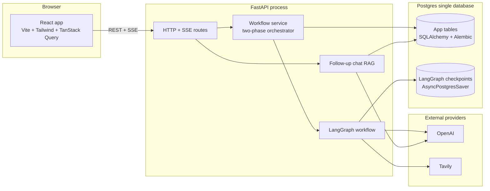
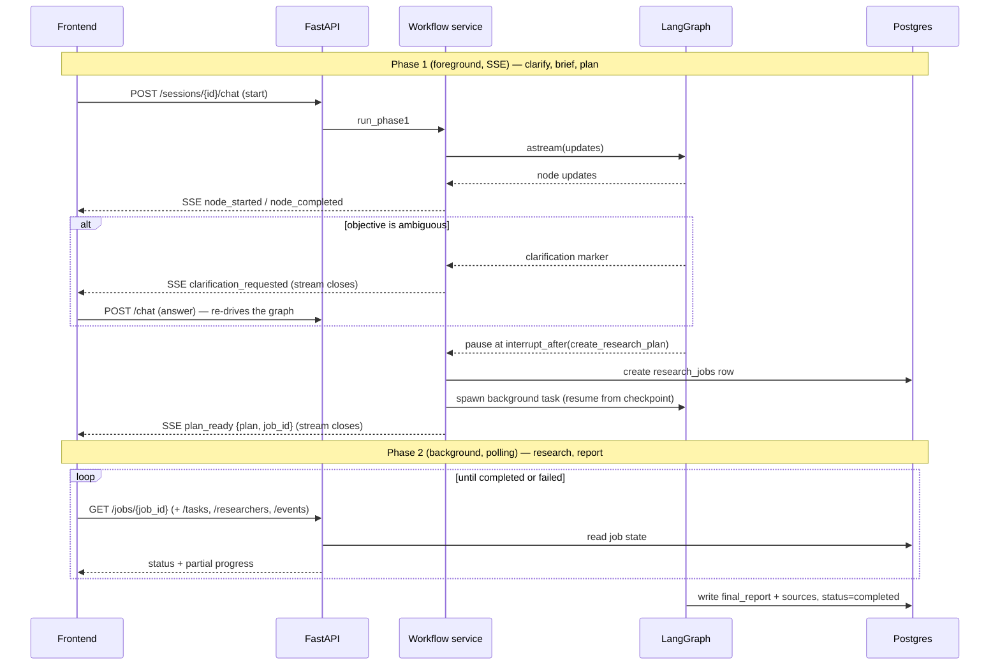
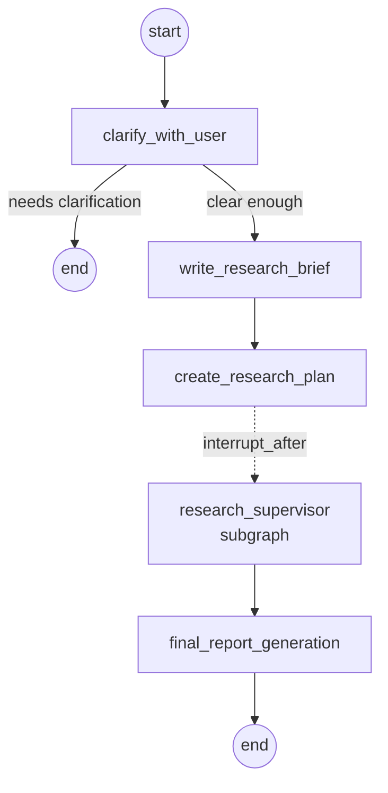
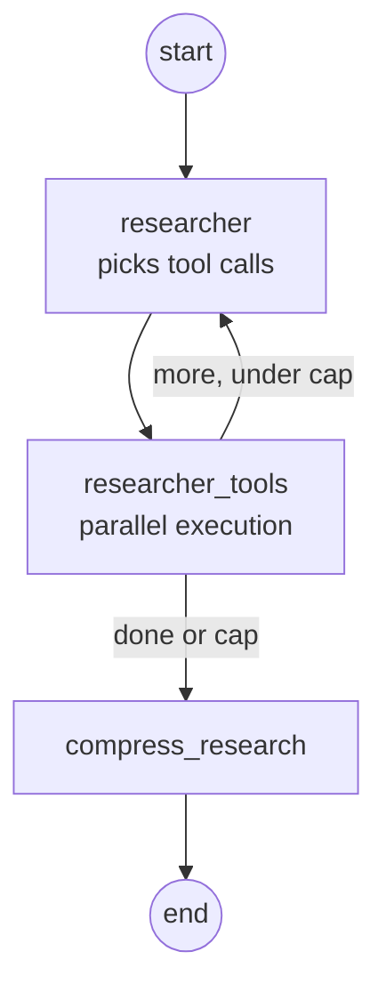

# Architecture

AI Research Copilot turns a company name, website, and research objective into a structured sales briefing, then lets the user chat with that briefing. This document explains how the system is put together: the moving parts, how they talk to each other, how the LangGraph workflow runs, and how the design holds up when things go wrong.

## 1. The big picture

The shape is the one the brief suggests (Frontend, then Backend APIs, then AI workflow, then storage), but with two design choices that shape everything else:

1. **The research run is split into two phases.** A short interactive phase streams over SSE, and a long research phase runs in the background and is polled. More on this in section 4.
2. **There are two stores in one database.** The LangGraph checkpointer owns in-flight graph state, and the application tables own the durable products (sessions, reports, chat). They are kept separate on purpose. More on this in section 5.

## 2. The stack

| Layer | Choices |
|---|---|
| Frontend | React 18, TypeScript, Vite, Tailwind, TanStack Query, React Router, react-markdown |
| Backend | Python 3.11, FastAPI, SQLAlchemy 2.0 (async, asyncpg), Pydantic settings, structlog |
| AI workflow | LangGraph (multi-graph), OpenAI for reasoning and writing, Tavily for search |
| State and durability | Postgres for app tables, plus the LangGraph `AsyncPostgresSaver` checkpointer |
| Transport | REST for reads and actions, Server-Sent Events for live progress and token streaming |
| Schema | Alembic migrations for app tables; the runtime never runs DDL |

## 3. Component breakdown

**Frontend (`frontend/src`).** A single-page React app. Routes cover the landing page, sign in and sign up, the dashboard (session history plus create form), and the session detail page. The session page is where most of the work shows: a chat panel, a clarification card, a plan view, the live progress chips, the rendered report, and source citations. Server state is held in TanStack Query; the two live streams (workflow progress and follow-up chat) are read over SSE through dedicated hooks (`useWorkflowChat`, `useReportChat`), with `useSessionStatus` polling the job while research runs. `lib/types.ts` mirrors the backend event types so the two sides stay in step.

**Backend API (`backend/app/api`).** Thin FastAPI routers grouped by concern: auth, users, sessions, the workflow stream, job reads, and follow-up chat. Routers do request validation, ownership checks, and shaping; they hand the real work to the service layer. Every route that touches a session or job confirms the caller owns it, and an ownership mismatch returns 404 rather than 403 so we never leak that a record exists.

**Workflow service (`backend/app/services/workflow_service.py`).** The orchestrator. It builds the graph and its run config in lockstep, drives phase 1 inline as an event stream, and at the right boundary spawns the phase-2 background job. One instance lives on `app.state` for the process lifetime and tracks in-flight background jobs so a session cannot start two research runs at once.

**LangGraph workflow (`backend/app/workflow`).** The AI core, covered in detail in section 6.

**Follow-up chat (`backend/app/services/report_chat.py`).** A separate, simpler path. Once a report exists it answers questions using retrieval over the finished report and its sources. It runs no new research. The prompt is grounded-only: the brief is the single source of truth, the model is told to say when something is not covered rather than guess, and it cites source IDs inline. Replies stream token by token over SSE and each turn is persisted.

**Providers (`backend/app/providers`).** A small abstraction over the LLM and search vendors, covered in section 7.

**Cross-cutting (`backend/app/core`).** Config (Pydantic settings from environment), structured logging with a per-request ID bound through contextvars, JWT auth, and a central error handler that turns typed `AppError`s into clean JSON with a stable code and status.

## 4. Execution model: two phases

A full research run can take minutes. Holding that on a single streamed HTTP connection is fragile: a dropped connection would lose the run, and the server would be tied to the socket. So the run is cut at a natural seam.

**Phase 1 is interactive and streamed.** The service drives `clarify_with_user → write_research_brief → create_research_plan` inline and streams a `node_started` / `node_completed` pair per node as SSE. The stream ends in one of three ways: the workflow asks a clarifying question (and waits for the user to answer with another `/chat` call), the workflow reaches the plan and pauses, or it fails.

**The pause is a `interrupt_after=["create_research_plan"]` boundary, not a human approval gate.** It exists only so the SSE handler can close cleanly after delivering the plan. The moment the graph pauses there, the service writes a `research_jobs` row, threads its `job_id` into the run config, spawns an `asyncio` task to resume the graph from its checkpoint, and emits `plan_ready` with the job ID.

**Phase 2 is background and polled.** The background task runs `research_supervisor → final_report_generation` to completion, persisting progress as it goes. The frontend polls the job row (plus the task and researcher endpoints for live detail) until the status is `completed` or `failed`. A 30-minute timeout caps a runaway run, and the background runner never raises: any failure is logged and written to the job as `failed`.

This split is what makes the run **recoverable**. Because the graph checkpoints at `session_id` as its thread ID, phase 1 can tell a fresh start from a resume (it inspects existing state and "subscribes" instead of re-seeding), and the background phase always resumes from the last checkpoint rather than from scratch.

## 5. Data model and persistence

Everything lives in one Postgres database, but there are two distinct owners.

**The LangGraph checkpointer** (`AsyncPostgresSaver`) owns the running graph: messages, intermediate state, and the pause points. It keeps its own connection pool and its own `checkpoints*` tables, created by its `setup()` at startup, and is not tracked by Alembic. The thread ID is the session ID, so a session and its graph state are the same identity.

**The application tables** (SQLAlchemy, Alembic-managed) own the durable, user-facing data:

| Table | Holds |
|---|---|
| `users` | Accounts and password hashes |
| `sessions` | One row per research session. The session *is* the chat thread; its ID is the graph thread ID. Stores company, website, objective, title, and status. |
| `session_messages` | Follow-up chat turns over a finished report |
| `research_jobs` | One phase-2 run: status, the plan, the final report JSON, the deduped sources, and an optional PDF key |
| `research_job_events` | A JSON-safe slice of each node update, for poll-time visibility |
| `research_job_researchers` | Per-researcher results and the sources each one found |
| `research_tasks` | Live "what is running now" chips for the progress UI |

The reason for the split: conversation and graph internals change shape as the workflow evolves and are awkward to model as relational rows, so they stay in the checkpointer. The things a user comes back to (their sessions, the report, the chat history, job status) need clean queries, indexes, and migrations, so they live in normal tables. Job lifecycle writes are deliberately placed close to the data that produces them: the supervisor node writes per-researcher rows and task status directly, because it is the only place that holds both the task definition and its result.

## 6. The LangGraph workflow

This is the heart of the product. It is not one model call; it is three nested graphs with shared state, conditional routing, parallel fan-out, and graceful degradation.

### 6.1 Top-level graph

- **clarify_with_user** decides whether the objective is specific enough. If not, it asks one to three questions and routes to the end via `Command(goto=...)`; the user answers and the graph re-runs. This is the conditional-routing requirement in its clearest form.
- **write_research_brief** turns the conversation into a tight, structured research goal.
- **create_research_plan** breaks the goal into an ordered list of subtopics, each tagged with which tools to use and whether to go for depth or breadth. The graph pauses right after this node (see section 4).
- **research_supervisor** is itself a compiled subgraph (6.2).
- **final_report_generation** writes the eight-section report (6.4).

Each node is wrapped so it emits `node_started`, `node_completed`, or `node_failed` events with timing as it runs.

### 6.2 Supervisor subgraph (the multi-agent layer)

The supervisor is an LLM bound to three tools: `ConductResearch` (delegate one research task), `ResearchComplete` (stop), and a `think_tool` for short reflections. Each round, `supervisor_tools` dispatches the `ConductResearch` calls as independent researcher subgraphs in parallel via `asyncio.gather`, capped at a configurable number per round (default five); any overflow is told to retry next round. It then feeds the results back and loops, until the supervisor calls `ResearchComplete`, makes no tool calls, or hits the iteration cap (default four). This is the planner-then-parallel-workers pattern, and the caps are what keep cost and time bounded.

### 6.3 Researcher subgraph

Each researcher is a small ReAct loop. It chooses among `company_site_search` (scrape the company's own pages), `web_company_search` (external news, funding, reviews, with the company name anchored automatically), and `think_tool`, with the available set and routing decided by the plan's per-subtopic tool choice. Tool calls run in parallel, each with a 120-second timeout and two retries with backoff. When the loop ends, `compress_research` synthesizes the raw findings into a citeable summary and extracts `Source` records.

A subtle but important detail: a **fresh** researcher subgraph is built per `ConductResearch` call, never a shared singleton, so parallel researchers cannot stomp on each other's state.

### 6.4 Report generation and citation integrity

The final report is a two-pass process. Pass one produces all eight sections at once as structured output (`ReportContent`). Pass two reviews each section in parallel to tighten the prose and re-check citations.

Citations are handled defensively end to end. Sources are not invented: each researcher's tool output carries machine-readable source markers, and a source ID is derived deterministically from the URL (`src_` plus a hash). When the writer fills in `source_ids` for a section, any ID it did not actually have is filtered out against the set of real sources, in both passes. If structured generation fails even after truncation retries, a fallback report is returned with the raw findings, so the run always yields *some* usable output rather than an error.

### 6.5 Shared state and reducers

The graphs communicate through typed state (`AgentState`, `SupervisorState`, `ResearcherState`). Two custom reducers do the merging: an append-by-default list reducer with an explicit override escape hatch (used to reset notes between runs), and a source reducer that deduplicates by URL as results stream in from many researchers at once. The plan is stored as a plain dict rather than a Pydantic object because that round-trips cleanly through the checkpointer's serializer.

## 7. Providers and configuration

The workflow never imports a vendor SDK directly. A factory returns an LLM provider and a search provider behind small interfaces. With API keys present it returns OpenAI and Tavily; with keys missing it returns mock providers that produce believable canned data, so the entire workflow runs end to end with no external accounts. That makes local development, demos, and CI cheap and offline-friendly, and it means swapping a vendor is a provider change, not a workflow rewrite.

The search provider is deliberately reachable from two places: on the workflow dependencies object, and inside the run config, because the researcher tools pull it out at call time through the injected config. Both references point at the same instance.

OpenAI access supports an optional pool of keys that the model factory rotates through, with a cooldown applied to any key that returns a rate-limit error. This spreads load across keys when running against rate-limited endpoints.

All tuning lives in one settings object read from the environment: model and keys, search depth and results per query, the concurrency and iteration caps for the workflow, JWT settings, the database URL, CORS origins, and log level.

## 8. Cross-cutting concerns

- **Auth.** Server-issued HS256 JWTs. A dependency resolves the current user on protected routes; ownership is checked on every session and job access.
- **Logging and tracing.** Structured logs throughout. A middleware assigns or echoes an `x-request-id` and binds it (plus the path) to the logging context, so every log line in a request is correlated, and the ID is returned to the client.
- **Error handling.** Typed `AppError`s carry an HTTP status and a stable machine-readable code; a central handler renders them consistently. Examples include "run already in flight", "report not ready", and "PDF renderer unavailable".
- **Migrations.** Alembic owns all DDL for the app tables; the application never creates or alters tables at runtime. The checkpointer manages its own tables separately.
- **Deployment.** Docker Compose brings up Postgres, the backend, and the frontend together. PDF export depends on native libraries (WeasyPrint and friends); if they are absent the app still boots and only the PDF endpoint returns a clear 503.

## 9. Failure handling at a glance

| Failure | Where | Response |
|---|---|---|
| Ambiguous objective | clarify node | Ask the user, pause, resume on answer |
| A search tool times out or errors | researcher tools | Retry with backoff, then return an error note and carry on |
| Token limit exceeded | supervisor, researcher, report | Drain or truncate and retry; never crash the run |
| Too many research tasks in one round | supervisor | Cap per round, tell overflow tasks to retry next round |
| Structured report generation fails | final report | Return a fallback report built from raw findings |
| Background run hangs | background job | 30-minute timeout marks the job failed |
| Any background exception | background job | Logged and written to the job as `failed`; never raised |
| Dropped SSE connection | phase 1 | The run is checkpointed; reconnecting subscribes to existing state |

## 10. Where the design is intentionally simple

The architecture is built to be correct and recoverable first. A few things are deliberately left for later and are covered in `product-improvements.md`: research is web and company-site only with no structured signal sources, the briefing is a one-time snapshot with no monitoring, there is no CRM or inbox integration, and there is no per-claim confidence or freshness layer on top of the existing citations. The seams above (the provider abstraction, the job model, the grounded chat path) are where those features would attach.
